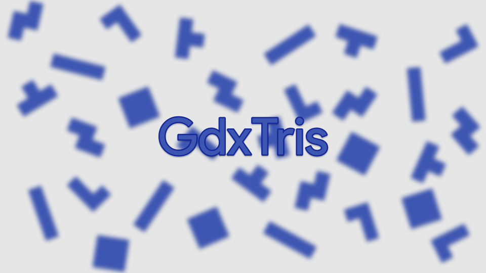
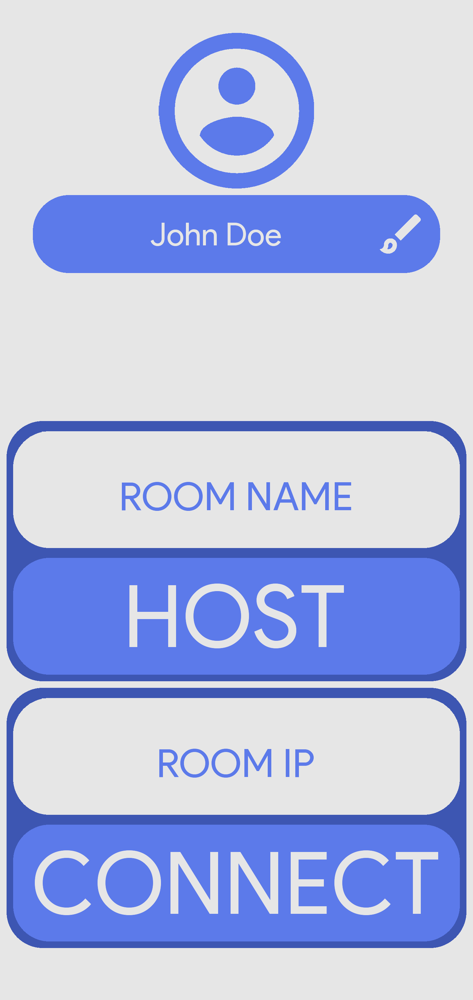
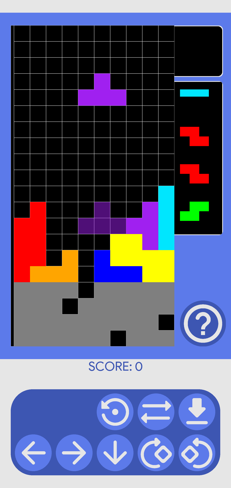
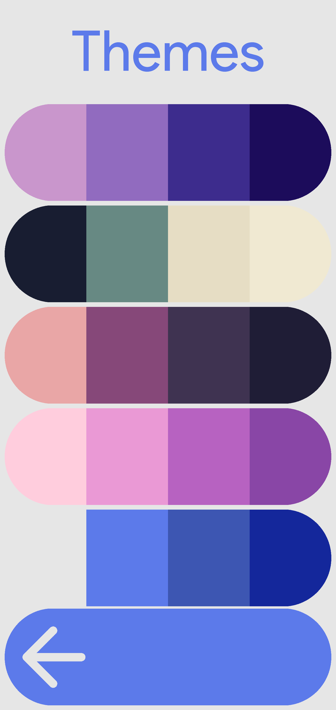

    

    
    
    

    
    

> **Note**
> The initial release of this project was on January 25, 2022. From that time the project had only seen minor improvements and fixes. However, as you can see from [these](https://github.com/Smooth-E/gdxtris/commits/project?since=2023-01-01) recent commits, I decided to start rewriting the project, improving code readability and switching to new and more appropriate concepts and technologies. To summarize it all up, I am not currently accepting new Pull Requests for this project, even tho further the development of it will probably be slow.

GdxTris is a game made according to the Tetris [Guidelines](https://tetris.wiki/Tetris_Guideline) and inspired by [JSTris](https://jstris.jezevec10.com/). It is a game where you compete with other players, connected to the same local network.

## How to play

In order to play, you and your opponents have to connect to the same local network (network doesn't need to have an internet access ^.^).

Next up, one of the players should tap on HOST in game's main menu. They will create a room on their device. Then they have to tap on the question mark button, here they can see their local ip address, which they have to provide to other players in order for them to connect.

Other players then have to input host's ip address into the room ip field and then tap on connect. If everything went okay, you all will be connected to the host and be ready to play. Ask the host to start the game and compete!

## Game mechanics

Clear the lines to gain points. Scoring goes as it is described in [guidelines](https://tetris.wiki/Tetris_Guideline). When the game starts, it assigns a "victim" for every player in the room. So every participant acts as an attacker for someone and as a victim for someone at once. When you clear any amount of lines, this amount gets sent to your victims pocket (4-line clear however sends 8 lines of garbage to your opponent). If you are not performing any line clears in a certain amount of time, your victim's pocket gets empty and the amount of lines which was there gets sent to player's field as some garbage lines. Perform line clears faster and more efficient than your opponents to beat them!

## Other features

1. Change app's color theme by tapping the brush icon in main menu.
2. Change your username that will be shown to other players (from main menu also).
3. Watch how other players perform during the session. In order to do so, tap onto question mark icon on the bottom right, then tap onto the eye icon next to the listed player, that you want to watch.
